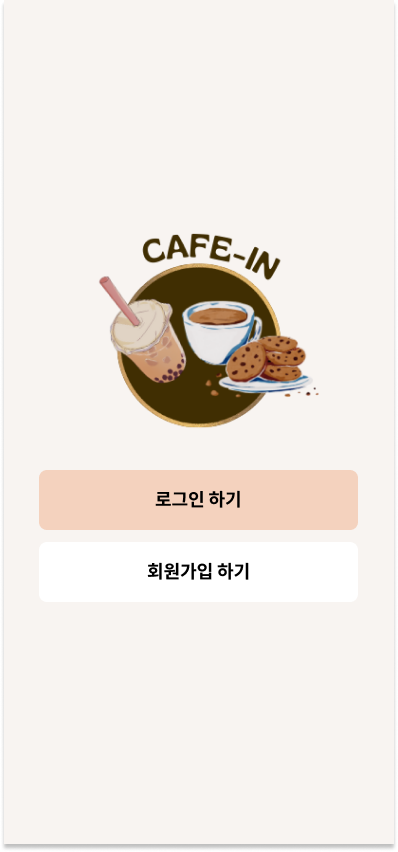
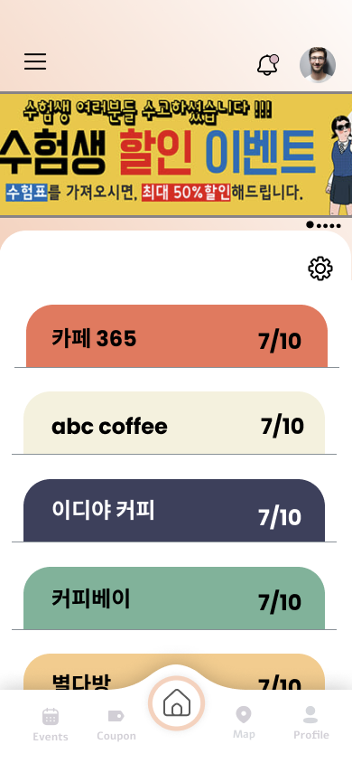
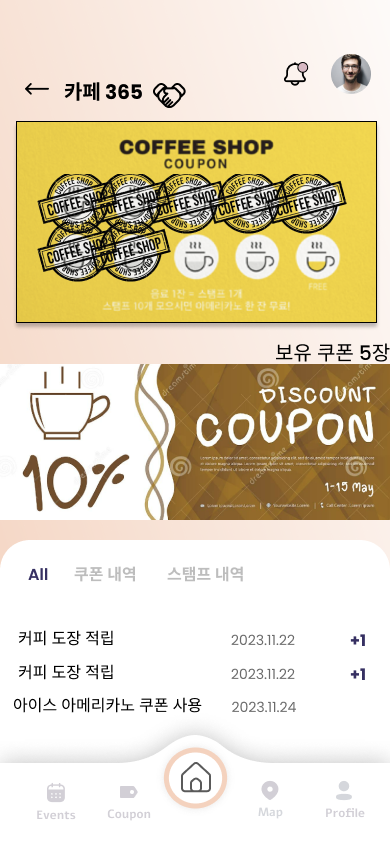
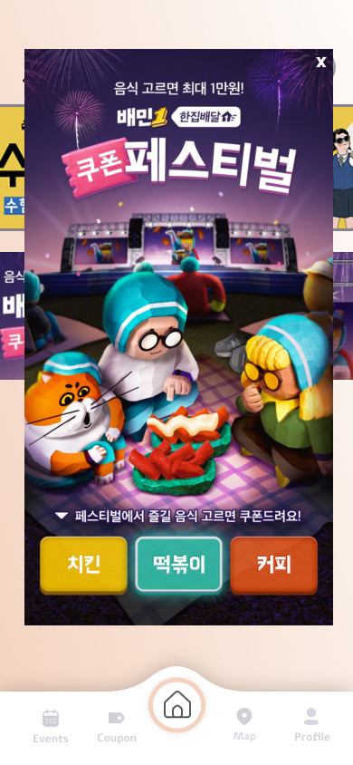

# Cafe-in

## 소상공인 카페를 위한 쿠폰 통합 웹앱 플랫폼

    
    
    
    

## 개발 목적

1. **종이 쿠폰 관리의 불편함**  
   종이 쿠폰은 분실과 훼손이 쉽고, 운영자가 관리하기에도 번거롭다는 문제점이 있습니다. 도장 누락이나 중복 사용 등의 문제를 해결하기 위해 디지털 쿠폰 시스템을 도입하여 편리하고 효율적인 관리가 가능하도록 합니다.
2. **소상공인 운영자분들의 어려움**  
   프랜차이즈 카페의 증가로 인해 소상공인 카페가 홍보와 고객 유치에 어려움을 겪고 있습니다. 이를 해결하기 위해, 소상공인 카페만을 위한 맞춤형 마케팅 도구를 제공하는 웹 플랫폼을 개발하여 효과적인 홍보와 고객 관리를 지원합니다.

## 사용 기술

<table>
  <tr>
    <td>언어</td>
    <td>Javascript, HTML, CSS, PHP</td>
  </tr>
  <tr>
    <td>서버</td>
    <td>Apache Tomcat 10</td>
  </tr>
  <tr>
    <td>라이브러리</td>
    <td>jQuery</td>
  </tr>
  <tr>
    <td>DB</td>
    <td>MySQL</td>
  </tr>
  <tr>
    <td>IDE</td>
    <td>Groom IDE</td>
  </tr>
  <tr>
    <td>API</td>
    <td>Kakao map api</td>
  </tr>
</table>
